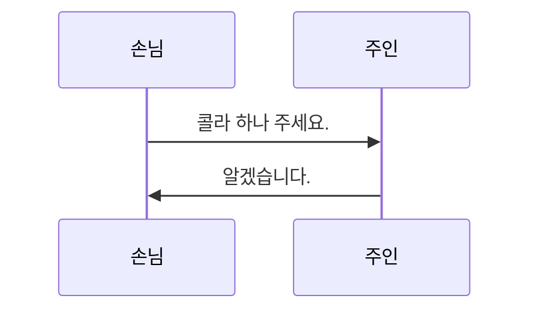

%%
마크다운이 기억이 안 나면
1. 노트에서 우클릭을 하여 사용하려는 마크다운을 찾습니다.
2. Editing toolbar와 같은 커뮤니티 플러그인을 사용하는 것도 괜찮습니다.
%%
# 1. 제목은 다음과 같이 \#을 사용하여 작성합니다.
## 이것은 제목 2
### 이것은 제목 3
#### 이것은 제목 4
##### 이것은 제목 5
###### 이것은 제목 6


# 2. 텍스트를 꾸미기
일반 글자
**굵게할 글자**
*기울일 글자*
~~취소할 글자~~
==강조할 글자==

# 3. 인용문
> 이런 식으로
> 여러 줄에 걸쳐서
> 인용문을 작성할 수 있다
> 				-시안

# 4. 코드 블록과 인라인 코드
## 인라인 코드
노트 작성 중에 `인라인 코드`를 작성할 수 있습니다.
## 코드 블록
```python
print("hello")
print("obsidian)
```
+)Mermaid로 다이어그램 넣기


# 5. 리스트
- 리스트는 공통으로 다음 기능을 가집니다.
	- Tab으로 들여서 쓸 수 있고
- Shift+Tab으로 내어 쓸 수 있습니다.

- [ ] 태스크 리스트도 마찬가지로
	- [ ] 들여서 쓸 수 있습니다.
- [x] 그리고 체크 표시도 할 수 있습니다

1. 첫 번째 리스트
2. 두 번째 리스트
3. 세 번째 리스트


# 6. 수평바
동해물과 백두산이 마르고 닳도록
하느님이 보우하사 우리나라 만세

---

무궁화 삼천리 화려강산
대한 사람 대한으로 길이 보전하세